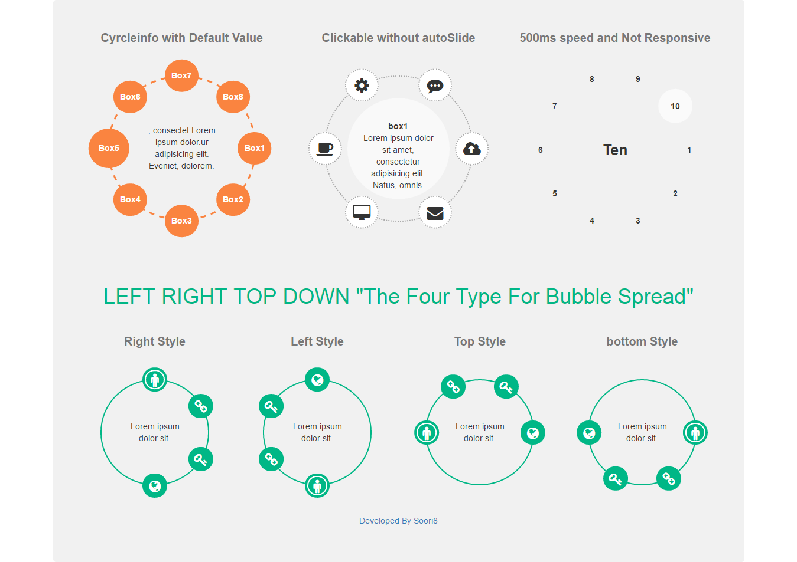

# JQuery Circle Info Box Plugin V1.0
This is my exercise in JQuery, if you willing to use it feel free to report me the bugs or issues to fix it. or if you are a developer i will be happy to hear from you about my project and the ways i can improve my way of coding.

The folder contains a source of the Plugin and a demo file That you can see the Demo here in Github [Circle Info Box Plugin](https://htmlpreview.github.io/?https://github.com/soori8/CircleBoxInfo/blob/master/Demo/index.html).



Just need to call function in one of your element like 
```sh
$(Parent element).s8CircleInfoBox();
```
and your Html structure Must be like
```sh
<div class="circle2">
    <ul class="circleWrapper">
        <li>
            <div class="circleFeature" data-cyrcleBox="feature1"></div>
            <div class="circleBox" id="feature1"></div>
        </li>
    </ul>
</div>
```
In this plugin you will be able to controll:
- Enable/Disable auto slide
- Speed of the auto Slide
- Enable/Disable the Responsive mode at a certain breakpoint
- Change the action between Hover and Click on every single bubble
- add your custom style for selected bubble
- You could choose the Spread type of the bubbles between Top,Buttom,Left,Right and all
- also you can handle the breakpoint size to match with your CSS Query

I will be happy to hear from you,
### Enjoy Your Life ...
